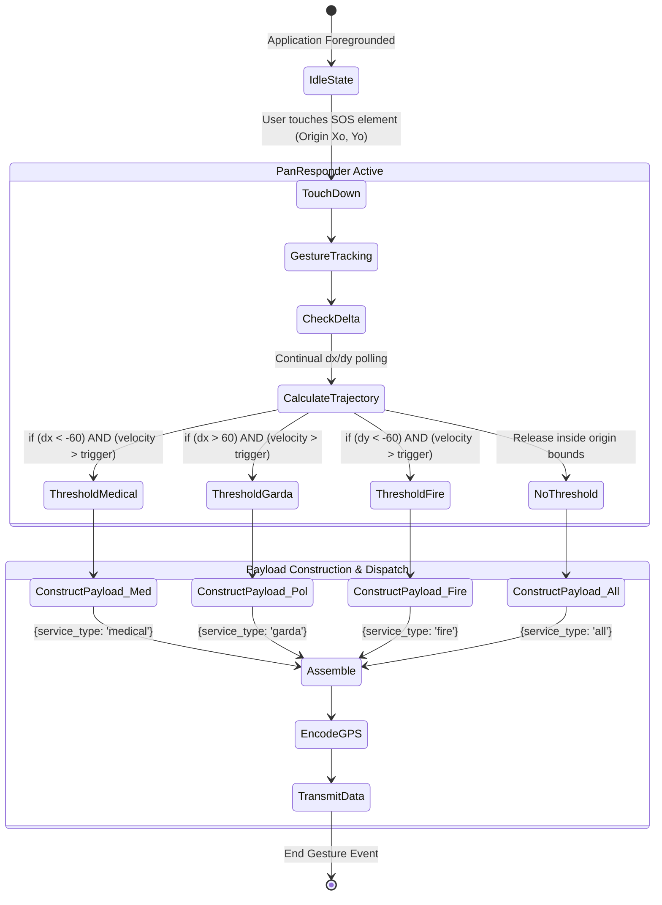
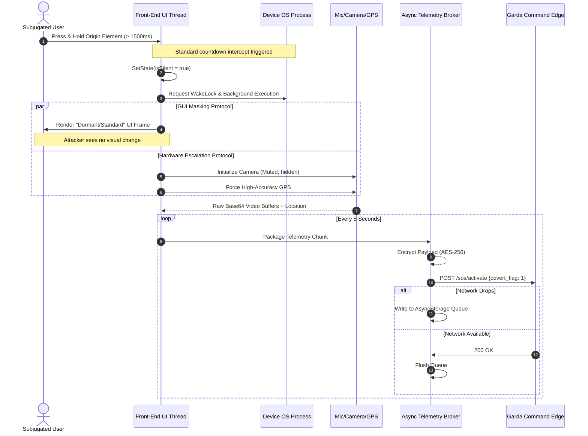
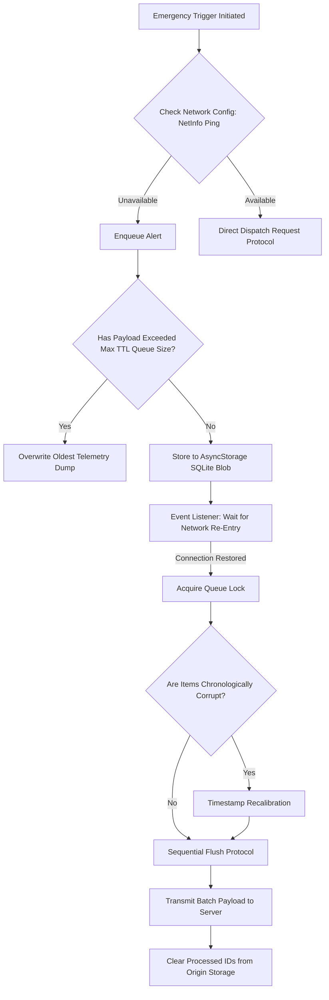
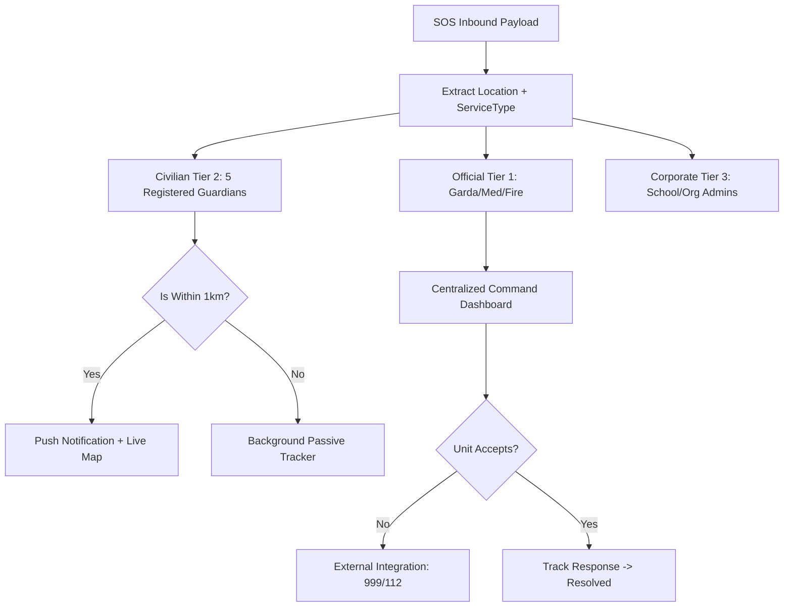

# Invention Disclosures: SLÁN Sovereign Citizen Safety Platform

> **STATUS:** CONFIDENTIAL / PRE-FILING
> **INVENTORS:** [Project Team / Antigravity]
> **DATE:** 2026-04-28

## Purpose
This document provides the formal technical descriptions and diagrams required for the filing of a Provisional Patent Application. It details five distinct but integrated inventions that constitute the SLÁN Safety ecosystem.

---

## CLAIM 1: Integrated End-to-End Emergency Lifecycle Orchestration
**Core Workflow Patent**

### Technical Description
A system and method for the automated management of an emergency event lifecycle. The system orchestrates a chain of custody for emergency data starting from a multi-axial gestural trigger, transitioning through a hardware-decoupled telemetry stream, persisting via a delay-tolerant edge queue, and terminating in a prioritized dispatcher interface with multi-tier coordination between official agencies and civilian guardians.

### Key Technical Elements
1.  **Unified Trigger-to-Resolution Pipeline:** Synchronizes disparate hardware and software subsystems into a single transactional state.
2.  **Cross-Agency Handshake Protocol:** Automatically determines if an event requires Garda, Fire, or Medical based on the initial gestural vector.
3.  **Real-Time Metadata Feedback:** Provides continuous escalation updates to the user while maintaining secure, encrypted logs for law enforcement evidence.

---

## CLAIM 2: Multi-Axial Gestural Emergency Triage System
**Specific Interaction & Triage Patent**

### Technical Description
An interface for emergency service selection that utilizes a single-touch origin point followed by multi-axial vector analysis (swipe direction and velocity) to categorize and transmit an emergency data payload. This system eliminates the cognitive load of multi-step UI selection during acute physiological stress by mapping physical movement directly to data schemas.

### Key Technical Elements
1.  **Origin-Point Vector Mapping:** Tracks the initial contact coordinates (Xo, Yo) and calculates real-time delta changes.
2.  **Velocity-Based Thresholding:** Utilizes mathematical triggers (dx/dy > 60px within t < 200ms) to distinguish intentional dispatch from accidental touches.
3.  **Direct-to-Payload Construction:** Bypasses GUI confirmation loops, assembling and transmitting the JSON payload (service_type) immediately upon gesture termination.

### FIG 1: Gestural Triage Logic

### Claim Notes:
*   **Novelty:** Continuous vector-to-payload mapping that eliminates the cognitive load of multi-step UI selection during acute stress.
*   **Threshold Constants:** Mathematical triggers (e.g., `dx/dy > 60px` within `t < 200ms`) define the specific physical movement required for categorization.

---

## CLAIM 3: Zero-UI Covert Telemetry State Architecture
**UI/Hardware Decoupling Patent**

### Technical Description
A state management architecture for mobile devices that decouples the visual user interface (GUI) state from the underlying hardware execution thread. The system actively suppresses standard OS-level recording indicators and renders a synthetic dormant interface ("Safe Screen") while concurrently escalating background data acquisition (Video/Audio/GPS) and encrypted transmission.

### Key Technical Elements
1.  **GUI State Bifurcation:** Maintains two parallel logical states—one dormant for the observer and one escalated for the system hardware.
2.  **Decoupled Hardware Polling:** Directly manages microphone and camera buffers without exposing a preview layer to the GUI thread.
3.  **Encrypted Background Streaming:** Packages telemetry data into encrypted packets (AES-256) for transmission over a background wake-lock to ensure data persistence during device locking.

### FIG 2: Covert Execution Sequence

### Claim Notes:
*   **Novelty:** The explicit decoupling of the GUI feedback loop from the underlying hardware execution state.
*   **Advantage:** Prevents "hostile observation detection," allowing for the covert generation of high-fidelity evidence.

---

## CLAIM 4: Asynchronous Delay-Tolerant Queue Re-Entry
**Data Persistence & Resilience Patent**

### Technical Description
An edge-computing synchronization protocol for emergency telemetry that captures and persists high-resolution geospatial and biometric data locally during network latency or total outage. This ensure that critical evidence (Snapshots/Coordinates) is recorded at the point of origin, rather than at the point of transmission.

### Key Technical Elements
1.  **State-Aware Local Persistence:** Uses an asynchronous SQLite-backed queue to store incident snapshots with original high-resolution timestamps.
2.  **Network Re-Entry Polling:** Monitors system connectivity state (NetInfo) and initiates a prioritized "Flush Protocol" upon signal restoration.
3.  **Sequential Integrity Verification:** Ensures data chunks are transmitted in chronological order and clears local process IDs only after a "200 OK" server handshake.

### FIG 3: Resilient Synchronization Flow

### Claim Notes:
*   **Novelty:** Geospatial "Snapshotting" at the point of origin, rather than the point of transmission, guaranteeing evidence fidelity across cellular dead zones.

---

## CLAIM 5: Multi-Tiered Distributed Escalation Matrix
**Decentralized Routing Algorithm Patent**

### Technical Description
A prioritized routing algorithm that dynamically bifurcates an emergency payload across multiple hierarchical notification tiers. The system calculates notification recipients based on geospatial proximity (proximity-meta) and organizational registration, ensuring a distributed community response while maintaining a centralized agency command link.

### Key Technical Elements
1.  **Multi-Tier Forking Logic:** Simultaneously alerts official responders (Garda), civilian guardians (Tier 2), and organizational administrators (Tier 3).
2.  **Proximity-Based Filtering:** Dynamically selects recipients based on real-time distance from the incident origin point.
3.  **Escalation Fallback Integration:** Automatically bridges to national emergency systems (999/112) if the primary agency units fail to acknowledge within a set TTL threshold.

### FIG 4: Escalation Forking Logic

### Claim Notes:
*   **Novelty:** The simultaneous forking of dispatch requests across both centralized governmental and decentralized civilian networks based on localized proximity metadata.

---

> **Disclaimer:** This document constitutes a formal invention disclosure. Unauthorized distribution may waive patent rights. These architectures represent non-obvious, technical solutions to critical public safety challenges.
